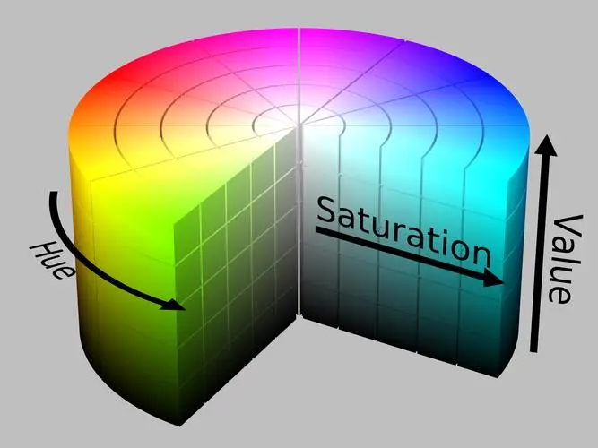
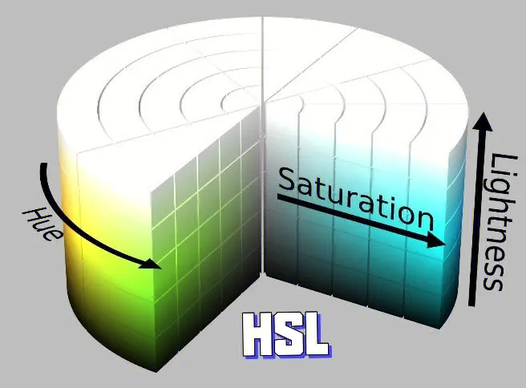
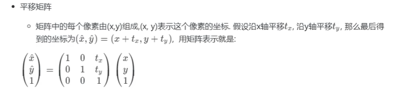

# 获取摄像头

```python
import cv2

if __name__ == '__main__':

    cv2.namedWindow('video',cv2.WINDOW_NORMAL) # 创建一个窗口
    cv2.resizeWindow('video',800,600)

    cap = cv2.VideoCapture(0) #打开摄像头
    # cap = cv2.VideoCapture("E:\资源\视频\阳光电影www.ygdy8.com.误杀.HD.1080p.国语中英双字.mp4") #打开视频

    while cap.isOpened():
        ret,frame = cap.read()
        if not ret:
            break
        cv2.imshow('video',frame)


        key = cv2.waitKey(1000 // 48)
        if key & 0xFF == ord('q') or cv2.getWindowProperty('video', cv2.WND_PROP_VISIBLE) < 1.0:
            break

    cap.release()
    cv2.destroyAllWindows()
```


# 录制视频

```python
import cv2


if __name__ == '__main__':

    cv2.namedWindow('video',cv2.WINDOW_NORMAL)
    cv2.resizeWindow('video',800,600)

    cap = cv2.VideoCapture(0) #打开摄像头

    fourcc = cv2.VideoWriter_fourcc(*'mp4v') # *:解包操作，视频类型为 mp4
    # 文件名，格式，帧率，分辨率
    vw = cv2.VideoWriter('output.mp4',fourcc,1000 // 48,(640,480))

    while cap.isOpened():
        ret,frame = cap.read()
        if not ret:
            break
        vw.write(frame) # 写入视频文件
        cv2.imshow('video',frame)

        key = cv2.waitKey(1000 // 48)
        if key & 0xFF == ord('q') or cv2.getWindowProperty('video', cv2.WND_PROP_VISIBLE) < 1.0:
            break

    cap.release()
    vw.release() # 保存到磁盘
    cv2.destroyAllWindows()
```


# 鼠标事件

```python

Event:
#define CV_EVENT_MOUSEMOVE 0                滑动
#define CV_EVENT_LBUTTONDOWN 1            左键点击
#define CV_EVENT_RBUTTONDOWN 2            右键点击
#define CV_EVENT_MBUTTONDOWN 3            中键点击
#define CV_EVENT_LBUTTONUP 4              左键放开
#define CV_EVENT_RBUTTONUP 5              右键放开
#define CV_EVENT_MBUTTONUP 6              中键放开
#define CV_EVENT_LBUTTONDBLCLK 7          左键双击
#define CV_EVENT_RBUTTONDBLCLK 8          右键双击
#define CV_EVENT_MBUTTONDBLCLK 9          中键双击

flags:
#define CV_EVENT_FLAG_LBUTTON 1           左键拖曳
#define CV_EVENT_FLAG_RBUTTON 2           右键拖曳
#define CV_EVENT_FLAG_MBUTTON 4           中键拖曳
#define CV_EVENT_FLAG_CTRLKEY 8         (8~15)按Ctrl不放事件
#define CV_EVENT_FLAG_SHIFTKEY 16       (16~31)按Shift不放事件
#define CV_EVENT_FLAG_ALTKEY 32         (32~39)按Alt不放事件


import cv2

# 鼠标事件处理函数，参数为：事件类型，鼠标坐标，鼠标状态（组合时使用），绑定事件时传递的参数
def mouse_event_callback(event,x,y,flags,userdata):
    print('event:{}'.format(event))
    print('location: x:{0} y:{1}'.format(str(x),str(y)))
    print('flags:{}'.format(flags))
    print('data:{}\n'.format(userdata))

if __name__ == '__main__':

    cv2.namedWindow('video',cv2.WINDOW_NORMAL)
    cv2.resizeWindow('video',800,600)

    cap = cv2.VideoCapture(0) #打开摄像头

    # 绑定鼠标事件，最后一个参数会传递给回调函数的 userdata 形参
    cv2.setMouseCallback('video',mouse_event_callback,'xiaoshanshan')


    while cap.isOpened():
        ret,frame = cap.read()
        if not ret:
            break
        cv2.imshow('video',frame)

        key = cv2.waitKey(1000 // 48)
        if key & 0xFF == ord('q') or cv2.getWindowProperty('video', cv2.WND_PROP_VISIBLE) < 1.0:
            break

    cap.release()
    cv2.destroyAllWindows()
```


# trackbar

```python
import cv2

# trackbar 回调函数
def trackbar_callback(value):
    print('trackbar_value:{}'.format(value))

if __name__ == '__main__':

    cv2.namedWindow('video',cv2.WINDOW_NORMAL)
    cv2.resizeWindow('video',800,600)

    cap = cv2.VideoCapture(0) #打开摄像头

    # trackbar,拖动条
    cv2.createTrackbar('R','video',0,255,trackbar_callback)
    cv2.createTrackbar('G', 'video', 0, 255, trackbar_callback)
    cv2.createTrackbar('B', 'video', 0, 255, trackbar_callback)

    while cap.isOpened():
        ret,frame = cap.read()
        if not ret:
            break
        cv2.imshow('video',frame)

        r = cv2.getTrackbarPos('R','video') # 获取 trackbar 的值
        
        key = cv2.waitKey(1000 // 48)
        if key & 0xFF == ord('q') or cv2.getWindowProperty('video', cv2.WND_PROP_VISIBLE) < 1.0:
            break

    cap.release()
    cv2.destroyAllWindows()
```


# 颜色空间

​		`RGB`：是通过对红、绿、蓝三个颜色通道的变化以及它们相互之间的叠加来得到各式各样的颜色的，`RGB`即是代表红、绿、蓝三个通道的颜色。

​		`BGR`：与`RGB`的差别在于三原色通道的顺序。

​		`HSV`：



​				`H`：色相，取值范围为`0 ~ 360`。红色为`0`，绿色为`120`，蓝色为`240`。

​				`S`：饱和度。取值为`0 ~ 100`，值越大，颜色越深艳。

​				`V`：明度。取值为`0 ~ 100`，值越大，颜色越明亮。

​		`HSL`：

​				


```python
import cv2


def trackbar_callback(value):
    print('trackbar_value:{}'.format(value))

if __name__ == '__main__':

    cv2.namedWindow('video',cv2.WINDOW_NORMAL)
    cv2.resizeWindow('video',800,600)

    cap = cv2.VideoCapture(0) #打开摄像头

    # 颜色空间转换
    colorspaces = [cv2.COLOR_BGR2RGBA,cv2.COLOR_BGR2BGRA,cv2.COLOR_BGR2GRAY,cv2.COLOR_BGR2HSV,cv2.COLOR_BGR2YUV]
    cv2.createTrackbar('curcolor', 'video', 0, 4, trackbar_callback)

    while cap.isOpened():
        ret,frame = cap.read()


        index = cv2.getTrackbarPos('curcolor','video')
        frame = cv2.cvtColor(frame,colorspaces[index])

        if not ret:
            break
        cv2.imshow('video',frame)


        key = cv2.waitKey(1000 // 48)
        if key & 0xFF == ord('q') or cv2.getWindowProperty('video', cv2.WND_PROP_VISIBLE) < 1.0:
            break

    cap.release()
    cv2.destroyAllWindows()
```


## 合并与分离

```python
import cv2

if __name__ == '__main__':

    while True:
        frame = cv2.imread('E:\pic\savanna\\20210409165937.jpg')

        b,g,r = cv2.split(frame) # 颜色通道分离

        b[10:100, 10:100] = 255
        g[10:100, 10:100] = 255

        img = cv2.merge((b,g,r)) # 合并颜色通道

        cv2.imshow('video',frame)
        cv2.imshow('video1', img)

        key = cv2.waitKey(1000 // 48)
        if key & 0xFF == ord('q') or cv2.getWindowProperty('video', cv2.WND_PROP_VISIBLE) < 1.0:
            break

    cv2.destroyAllWindows()
```

# Mat

​		`Mat`是`OpenCV`在`C++`语言中用来表示图像数据的一种数据结构，在`python`中转化为`numpy`的`ndarray`。

​		`Mat`由`header`和`data`组成，`header`中记录了图片的维数大小，数据类型等数据。

```python
import cv2
import numpy as np

if __name__ == '__main__':

    cv2.namedWindow('video',cv2.WINDOW_NORMAL)
    cv2.resizeWindow('video',1280,768)


    while True:
        frame = cv2.imread('E:\pic\savanna\\20210409165937.jpg')

		# 浅拷贝，header 不同，data 相同
        img = frame.view()
		# 深拷贝，header data 均不相同
        img2 = frame.copy()

        frame[10:100,10:100] = [0,0,255]

        cv2.imshow('video',np.hstack((frame,img,img2)))


        key = cv2.waitKey(1000 // 48)
        if key & 0xFF == ord('q') or cv2.getWindowProperty('video', cv2.WND_PROP_VISIBLE) < 1.0:
            break

    cv2.destroyAllWindows()
```


# 画图

```python
import cv2
import numpy as np
from PIL import ImageFont,ImageDraw,Image # 解决画中文的包


if __name__ == '__main__':

    cv2.namedWindow('video',cv2.WINDOW_NORMAL)
    cv2.resizeWindow('video',1280,768)
    cap = cv2.VideoCapture(0)

    while cap.isOpened():


        ret,frame = cap.read()

        # 画直线，参数为：图像，起始点，结束点，颜色，线宽，线型（0，4,8,16），坐标缩放比例（一般不写）
        cv2.line(frame,(10,50),(500,50),(0,0,255),12,8)
        # 画矩形，参数与画直线一样
        cv2.rectangle(frame, (400, 100), (600, 300), (0, 0, 255), 1, 8)
        # 画圆，参数为：图像，中心点，半径，其余与画直线一样
        cv2.circle(frame,(200,200),100,(0,0,255),1,8)

        # 画椭圆，参数为：图像，中心点，长轴、短轴长度的一半，倾斜角，开始角度，结束角度，其余与画直线一样
        cv2.ellipse(frame,(400,300),(40,20),45,0,180,(0,0,255),5,16)

        # 画多边形，参数为：图像，顶点集，是否闭合，其余与画直线一样
        pts = np.array([(90,90),(400,200),(50,50),(100,100)],np.int32)
        cv2.polylines(frame,[pts],True,(0,0,255),1,8)

        # 画填充多边形
        pts = np.array([(300, 70), (60, 100), (200, 300)], np.int32)
        cv2.fillPoly(frame,[pts],(0,0,255),8)

        # 画文字，参数为：图像，文本，坐标，字体，字体大小，颜色
        cv2.putText(frame,"opencv",(100,300),cv2.FONT_HERSHEY_SIMPLEX,2,(0,0,255)) # 这种方式中文会乱码

        # 画中文
        font = ImageFont.truetype('msyhbd.ttc',12) # msyhbd.ttc 为字体文件，可以在 C:\Windows\Fonts 找到
        frame = Image.fromarray(frame)
        draw = ImageDraw.Draw(frame)
        draw.text((200,400),'小杉杉',font = font,fill = (0,0,255,0))
        frame = np.array(frame)

        cv2.imshow('video',frame)


        key = cv2.waitKey(1000 // 48)


        if key & 0xFF == ord('q') or cv2.getWindowProperty('video', cv2.WND_PROP_VISIBLE) < 1.0:
            break

    cv2.destroyAllWindows()

```


# 图像运算

## 加减乘除

```python
import cv2

if __name__ == '__main__':

    img1 = cv2.imread('E:\pic\savanna\\20210409165937.jpg')
    img2 = cv2.imread('E:\pic\youname\\20191105164537.png')

    # print(img1.shape)
    # print(img2.shape)
    # 图片加法，要求两个图片的长、宽、维度是一样的。如果图片大小不一致可以采用切片的方式对大的图片进行裁剪
    # 将两个图片对应位置的元素相加，如果超过 255 ，则变成 255
    img = cv2.add(img1,img2)

    # 这种加法，是将图片的每个元素加上 100 然后 % 256
    #img1 += 100

    # 图片减法，对应位置的元素相减，如果小于 0，则变成 0
    # img = cv2.subtract(img1,img2)

    # 图片乘法，对应位置的元素相乘，如果大于 255，则变成 255
    # img = cv2.multiply(img1,img2)

    # 图片除法，对应位置的元素相除，如果小于 0，则变成 0
    # img = cv2.divide(img1,img2)

    cv2.imshow('video',img)

    key = cv2.waitKey(0)
    cv2.destroyAllWindows()
```


## 融合

```python
import cv2

if __name__ == '__main__':

    img1 = cv2.imread('E:\pic\savanna\\20210409165937.jpg')
    img2 = cv2.imread('E:\pic\youname\\20191105164537.png')

    # print(img1.shape)
    # print(img2.shape)
    # 图像的融合，参数为：第一个图像，第一个图像所占比重，第二个元素，第二个元素所占比重，偏差
    # 相当于对图像的每个位置上的元素做线性运算：x * weight1 + y * weight2 + b
    img = cv2.addWeighted(img1,0.2,img2,0.8,0)

    cv2.imshow('video',img)

    key = cv2.waitKey(0)
    cv2.destroyAllWindows()
```


位运算

```python
import cv2

if __name__ == '__main__':

    img1 = cv2.imread('E:\pic\savanna\\20210409165937.jpg')
    img2 = cv2.imread('E:\pic\youname\\20191105164537.png')

    # print(img1.shape)
    # print(img2.shape)

    # 非操作，相当于 255 - 每个位置上的元素
    img = cv2.bitwise_not(img1)

    # 与操作，两个图像对应位置上的元素进行与操作
    img = cv2.bitwise_and(img1,img2)

    # 或操作，两个图像对应位置上的元素进行或操作
    img = cv2.bitwise_or(img1, img2)

    # 异或操作，两个图像对应位置上的元素进行异或操作
    img = cv2.bitwise_xor(img1, img2)

    cv2.imshow('video',img)

    key = cv2.waitKey(0)
    cv2.destroyAllWindows()
```


# 放大与缩小

```python
import cv2

if __name__ == '__main__':

    img1 = cv2.imread('E:\pic\savanna\\20210409165937.jpg')
    # img2 = cv2.imread('E:\pic\youname\\20191105164537.png')

    # print(img1.shape)
    # print(img2.shape)
	
    # 参数为：操作图像，缩放之后的大小，缩放之后的输出图片，x 轴缩放比， y 轴的缩放比，插值算法（放大用）：cv2.INTER_NEAREST（效果差，速度快）、cv2.INTER_LINEAR、cv2.INTER_CUBIC、cv2.INTER_AREA（效果最好，计算时间长）
    img = cv2.resize(img1,(1280,768))

    cv2.imshow('video',img)

    key = cv2.waitKey(0)
    cv2.destroyAllWindows()
```


# 翻转与旋转

```python
import cv2

if __name__ == '__main__':

    img1 = cv2.imread('E:\pic\savanna\\20210409165937.jpg')

    # print(img1.shape)

    img = cv2.resize(img1,(1280,768))
    
    # 翻转，参数为：操作图像，翻转编码（> 0 : 左右翻转，= 0 ：上下翻转，< 0 : 上下左右翻转）
    img = cv2.flip(img,0)
    
    # 旋转，参数为：操作图像，旋转编码（ROTATE_180 : 旋转 180，ROTATE_90_CLOCKWISE ：顺时针旋转 90，ROTATE_90_COUNTERCLOCKWISE : 逆时针旋转 90）
	img = cv2.rotate(img,cv2.ROTATE_180)
    
    cv2.imshow('video',img)

    key = cv2.waitKey(0)
    cv2.destroyAllWindows()
```


# 仿射变换

## 平移

​		平移矩阵：



```python
import cv2
import numpy as np

if __name__ == '__main__':

    img1 = cv2.imread('E:\pic\savanna\\20210409165937.jpg')
    # img2 = cv2.imread('E:\pic\youname\\20191105164537.png')

    # print(img1.shape)
    # print(img2.shape)


	
    img = cv2.resize(img1,(1280,768))
    # 长，宽，通道数
    h,w,ch = img.shape
	# 平移矩阵
    m = np.float32([[1,0,200],[0,1,0]])

	# 仿射变换
    img = cv2.warpAffine(img,m,(w,h)) 

    cv2.imshow('video',img)

    key = cv2.waitKey(0)
    cv2.destroyAllWindows()
```


## 旋转任意角度

```python
import cv2
import numpy as np

if __name__ == '__main__':

    img1 = cv2.imread('E:\pic\savanna\\20210409165937.jpg')

    # print(img1.shape)

    img = cv2.resize(img1,(1280,768))
    h,w,ch = img.shape
	
    # 获取旋转矩阵，参数为：旋转的中心点，角度，缩放比
    m = cv2.getRotationMatrix2D((w / 2,h / 2),45,1.0)

    img = cv2.warpAffine(img,m,(w,h))

    cv2.imshow('video',img)

    key = cv2.waitKey(0)
    cv2.destroyAllWindows()
```


## 获取变换矩阵

```python
import cv2
import numpy as np

if __name__ == '__main__':

    img1 = cv2.imread('E:\pic\savanna\\20210409165937.jpg')

    # print(img1.shape)

    img = cv2.resize(img1,(1280,768))
    h,w,ch = img.shape
	
    # 获取旋转变换矩阵，通过原图与结果图的三个对应的点的坐标，计算出变换矩阵
    src = np.float32([[100,100],[200,200],[300,300]])
    dst = np.float32([[200,200],[400,400],[500,400]])
    m = cv2.getAffineTransform(src,dst)

    # 透视变换，将图像中的部分进行清晰展示，即将歪的图片拉正
    # 获取透视变换矩阵，通过原图与结果图的三个对应的点的坐标，计算出变换矩阵
    # src = np.float32([[100,100],[200,200],[300,300],[490,70]])
    # dst = np.float32([[200,200],[400,400],[500,400],[450,90]])
    # m = cv2.getPerspectiveTransform()
    
    img = cv2.warpAffine(img,m,(w,h))


    cv2.imshow('video',img)
    
    key = cv2.waitKey(0)
    cv2.destroyAllWindows()
```


